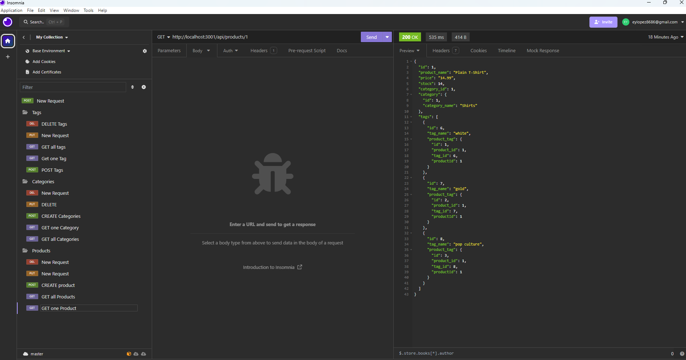

# E-commerce Back End Starter Code

# Description 📝
The purpose of this README generator is to provide a Sequilized back end e-commerce website for a retail company- utilizing an Express dependency.

# Table of Contents 📚

[Description](#Description-📝)
[Installation](#Installation)
[Usage](#Usage-💻)
[Questions](#Questions-📨)
[License](#License©)

#Installation
To install the project dependencies, follow these steps:

Fork and clone the repository [Professional-README-Generator](https://github.com/erikaylopez/ORM).
Run npm i to install dependencies in the local project directory.

# Usage 💻
Open integrated terminal.
Run node index.js.
Install npm i
Run Schema
Run Seed
Open localhost3001 in Insomnia 

# Questions 📨
For additional questions or concerns regarding the README file, contact:

Github: erikaylopez
Email: eylopez8686@gmail.com
Phone: 915-929-2209
Github: (https://github.com/erikaylopez)

# License ©
Licensed under the MIT license. Copyright @ MIT. All rights reserved.

# Screenshot

